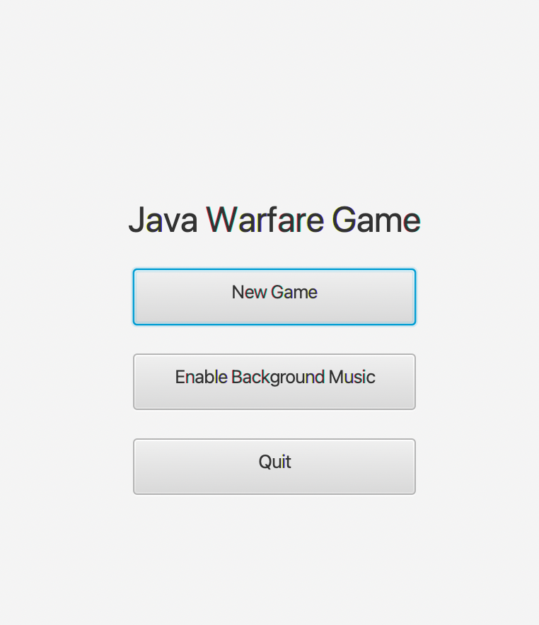
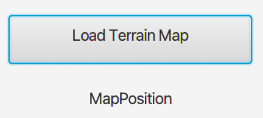
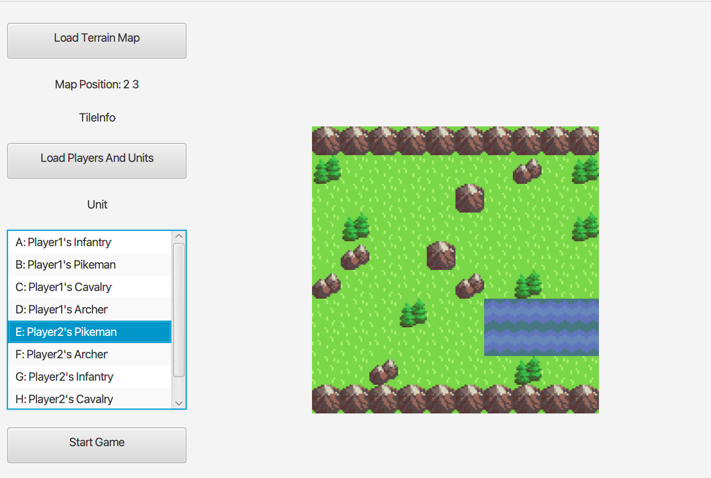
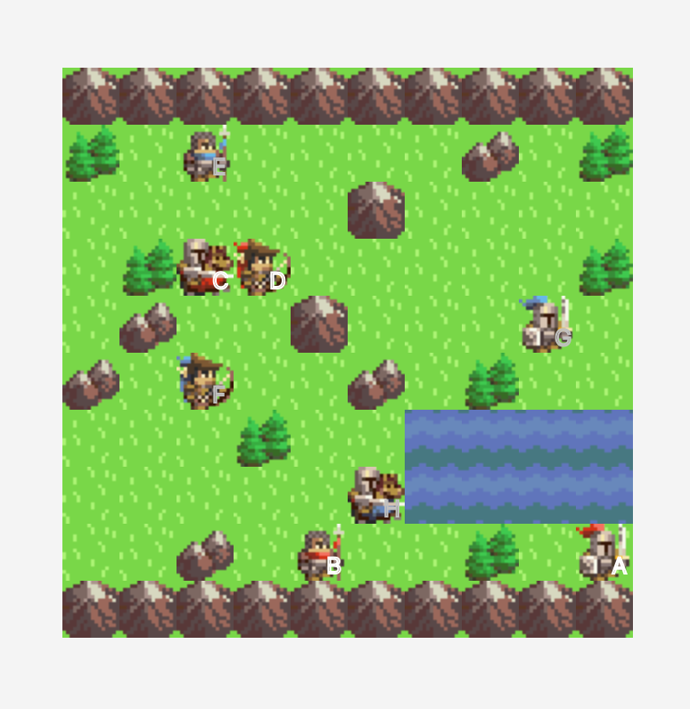

# Environment

openjdk version "15.0.2" 2021-01-19
OpenJDK Runtime Environment (build 15.0.2+10)
OpenJDK 64-Bit Server VM (build 15.0.2+10, mixed mode, sharing)
javafx-sdk-11.0.2

Developed Under Ubuntu Linux 16.04

# Command

Compile the .java files first: ```javac */*.java```

And run the Compiled application: ```java main.GameApplication```

# Instructions 

1. Click on New Game



2. Click on "Load Terrain Map" and select the file ```./terrainmap.txt```



You also may alter terrainmap.txt in the following structure: 
[hieght]
[wieght]
[grid1 type]
...
[grid height*weight type]

(Note grid type can vary from 0 to 4, with respective type: Plain, Forest, Hill, Mountain, Water)

3. Click on "Load Players and Units" and select the file ```./playerunits.txt```


You also may alter terrainmap.txt in the following structure: 
[# of players]
[Player Name 1]
[# of player 1 units]
[unit id 1]
[unit type 1]
...
[unit id n]
[unit type n]
........
[Player Name n]
[# of player n units]
[unit id 1]
[unit type 1]
...
[unit id n]
[unit type n]

(Note # of players can only be 2 to 5, and unit type takes values from ```Infantry```, ```Pikeman```, ```Cavalry```, and ```Archer```)

4. Click on every unit show in the "Unit" box and click on a specific grid in the map to place your units. (Default: 2 players with 4 units)



5. Click Start Game and engjoy! 


